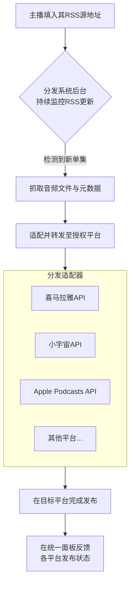

# 播客自动化分发解决方案

## 一、 方案概述

本方案旨在为播客主播提供一个**自动化、跨平台的内容分发SaaS工具**。核心是解决用户在多平台发布剧集时面临的重复手动上传、操作流程割裂的痛点。

方案采用播客行业标准的**RSS协议**作为分发中枢，通过集成国内外主流音视频及社交媒体平台的API，实现“一次发布，自动同步”的高效工作流。

## 二、 核心方案：RSS驱动的自动化分发引擎

我们的系统采用 **“基于RSS的订阅-解析-转发”** 模型，其工作流程如下：

1.  **主播接入**：播客主播登录我们的分发平台，在“内容源”设置中，填入其自主维护的播客RSS地址（如：`https://example.com/feed.xml`）。
2.  **系统自动化工作流**：系统后台将执行监控、抓取、适配、分发的全流程自动化操作。具体流程如下图所示：

### 为什么选择RSS？

我们选择RSS作为技术核心，基于以下关键优势：

1.  **标准协议，生态基础**：RSS是播客行业的基石性开放标准，Apple Podcasts、Spotify等所有国际主流平台均原生支持通过提交RSS接入。这确保了我们的系统能与全球播客生态无缝对接。
2.  **内容控制权归属主播**：主播的音频和元数据始终托管在其自选的服务器上，我们的系统仅作为分发渠道。这避免了主播被单一服务商锁定，保障了其长期的内容主权。
3.  **技术实现高效可靠**：RSS是一种基于HTTP的简单XML协议，通过轮询`<lastBuildDate>`或检查新`<item>`来监控更新，技术成熟稳定，易于构建高可靠的分发引擎。
4.  **符合自动化范式**：RSS天然支持“一次发布，多处同步”。主播只需更新其源RSS，即可触发后续全自动分发流程，实现“配置一次，永久自动”。

## 三、 市场痛点分析：国内播客生态现状

国内播客平台在开放性和自动化方面存在显著缺陷，这正是本方案要解决的核心问题：

1.  **对RSS支持薄弱**：多数平台（如荔枝、蜻蜓）**不支持**通过RSS自动同步。部分平台（如喜马拉雅、网易云音乐）虽标注支持，但实际因格式校验严格、服务器限制等问题，同步功能不稳定、体验差。
2.  **操作流程割裂且繁琐**：主播若想覆盖多个平台，必须**分别登录每一个平台的后台**，重复执行上传、填表、设置封面等完全相同的手动操作，耗时费力且易出错。
3.  **平台生态封闭，缺乏分发工具**：国内平台倾向于构建封闭生态，**未开放便捷的一键分发API**，导致市场缺乏成熟的第三方跨平台分发解决方案。
4.  **商业与合规门槛**：所有商业化平台均要求主播**实名认证**，增加了启动成本。内容审核也可能导致发布延迟，无法实现即时发布。

**结论**：国内“围墙花园”式的生态使得多平台运营的**边际成本极高**。我们的方案正是通过技术手段，在这些平台间搭建自动化桥梁。

## 四、 国际生态借鉴与现有工具评估

国际播客生态的成熟实践为我们提供了明确的方向。其共同点包括：
*   **普遍原生支持RSS分发**：将提交RSS Feed作为节目入驻的标准方式。
*   **提供专业创作者后台**：如Apple Podcasts Connect，体验统一。
*   **具备成熟的开放平台（Open API）**：支持OAuth授权，赋能第三方自动化工具。
*   **繁荣的第三方服务生态**：催生了托管、分析、分发等丰富工具。

基于此，我们对现有工具的能力边界评估如下：

*   **Auphonic**：卓越的**音频后处理自动化引擎**（响度标准化、降噪、章节标记），可作为分发前的优质预处理环节，但并非分发平台。
*   **Zapier**：强大的**通用工作流自动化平台**，但其边界在于：
    1.  **无法处理媒体文件**：仅能传递URL，不能转码或直接上传至播客平台。
    2.  **对专业播客API支持有限**：缺乏对复杂播客元数据发布的专业集成。
    3.  **非专精化工具**：不提供播客行业特定的状态跟踪、数据聚合等功能。

**结论**：Auphonic是“生产车间”，Zapier是“通用传送带”，但它们都**不是**专为播客多平台分发设计的“智能物流中心”。国际上的成功产品（如**Anchor.fm**的一键托管分发，**Repurpose.io**的RSS驱动扩播）验证了本方案的产品模式，但**专注于解决国内平台分发难题的一站式SaaS工具仍是市场空白**。

## 五、 产品定位与价值主张

我们的产品定位是：**专注于以中文市场为核心，打通国内外主流音视频及社交平台的播客一键分发SaaS工具**。

**核心价值**：
*   **对主播**：将N次手动上传简化为1次RSS配置+N次一键授权，极大提升运营效率，释放创作精力。
*   **对生态**：遵循开放标准（RSS），通过合法API集成，促进内容在封闭平台间的有序流动，提升行业整体效率。

---
**（播客分发网站管理面板示意图预留位）**
*此处可补充一张展示“内容源管理”、“已连接平台列表”、“同步状态监控”的网站后台截图，以直观呈现产品界面。*